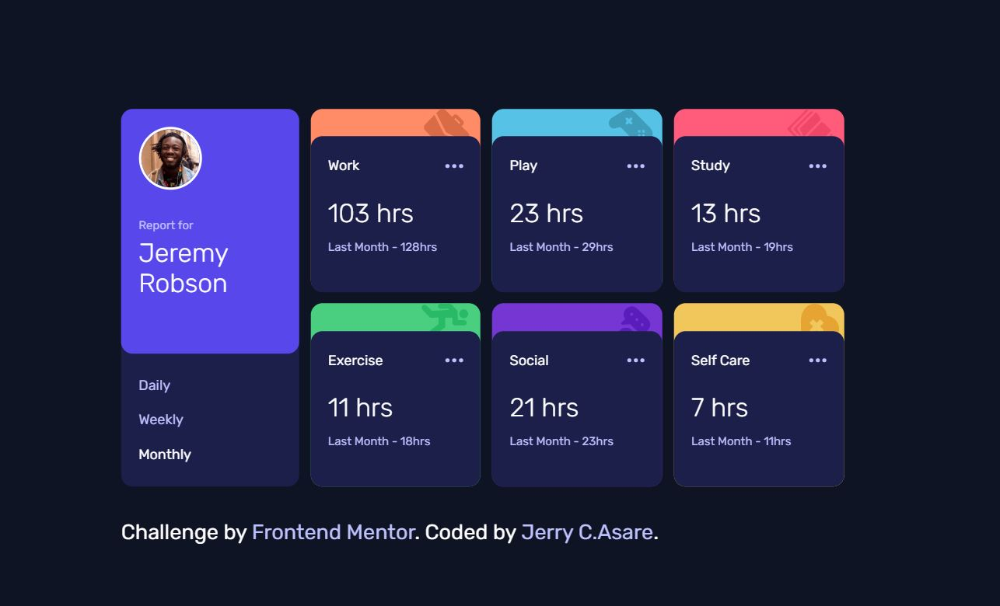

# Frontend Mentor - Time tracking dashboard solution

This is a solution to the [Time tracking dashboard challenge on Frontend Mentor](https://www.frontendmentor.io/challenges/time-tracking-dashboard-UIQ7167Jw). Frontend Mentor challenges help you improve your coding skills by building realistic projects.

## Table of contents

- [Overview](#overview)
  - [The challenge](#the-challenge)
  - [Screenshot](#screenshot)
  - [Links](#links)
- [My process](#my-process)
  - [Built with](#built-with)
  - [What I learned](#what-i-learned)
  - [Continued development](#continued-development)
  - [Useful resources](#useful-resources)
- [Author](#author)
- [Acknowledgments](#acknowledgments)


## Overview

### The challenge

Users should be able to:

- View the optimal layout for the site depending on their device's screen size
- See hover states for all interactive elements on the page
- Switch between viewing Daily, Weekly, and Monthly stats

### Screenshot





### Links

- Solution URL: [GitHub Repo](https://github.com/jcasare/FrontEndChallenges-time-tracker-dashboard)
- Live Site URL: [Live Site](https://jcasare.github.io/FrontEndChallenges-time-tracker-dashboard/)

## My process

### Built with

- Semantic HTML5 markup
- CSS custom properties
- Flexbox
- CSS Grid
- [Fetch API](https://developer.mozilla.org/en-US/docs/Web/API/Fetch_API) - API
- JavaScript


### What I learned

I learnt about how CORS policy when trying to access local JSON data. An alternative way of centering divs (using the transform:translate(-50%, -50%) element). Using the Fetch API to get JSON data.


```css
.proud-of-this-css {
    grid-gap: 10px;
    transform: translate(-50%, -50%);
}

```css{
fetch(myLink)
  .then(response => response.json())
  .then(data => {
    }
```

### Continued development

I'd like to continue learning the various ways of fetching data from APIs. This challenge enlightened me about the CORS policy.


### Useful resources

- [Fetch API](https://developer.mozilla.org/en-US/docs/Web/API/Fetch_API) - This helped me in fetching my json data deployed on github.


## Author

- LinkedIn - Jerry Comforter Asare](https://linkedin.com/in/jerry-asare-comforter/)
- Frontend Mentor - [@jcasare](https://www.frontendmentor.io/profile/jcasare)
- Twitter - [@vhybesofficial](https://www.twitter.com/vhybesofficial)


## Acknowledgments

I'd like to thank Angela Yu for her wonderful training....and also to Frontend Mentor for these challenges.
